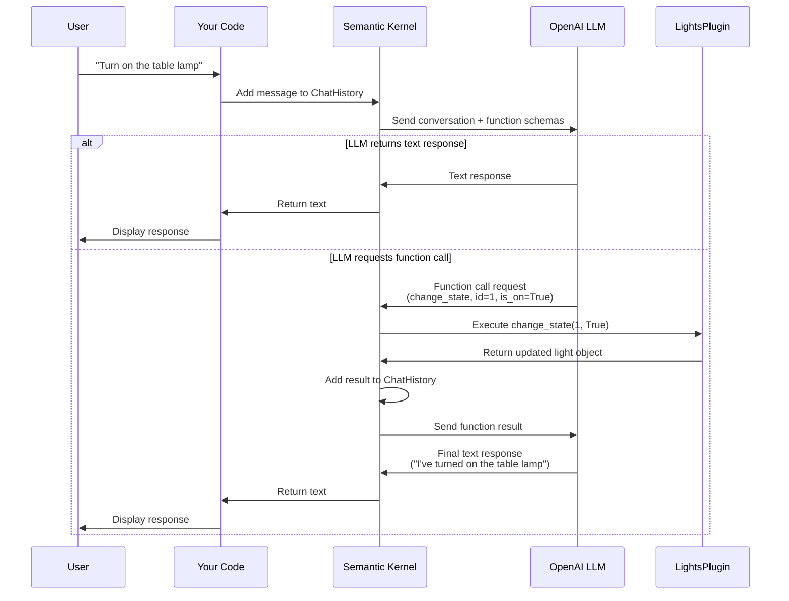

# Semantic Kernel Demo: LightsPlugin Chat

This is a demonstration script that shows how **Semantic Kernel** orchestrates conversations between users, LLMs, and custom plugins using function calling.

## What This Demo Does

This script creates an interactive chat application where an AI assistant can control a simulated smart home lighting system. The AI can:

- Check which lights are available and their current states
- Turn lights on or off based on natural language requests
- Have multi-turn conversations while maintaining context

## Architecture Overview

### Message Flow Diagram



### What Semantic Kernel Does For You

Semantic Kernel acts as the **orchestration broker** between your code, the LLM, and your plugins:

1. **Function Registration** - Converts your Python functions into OpenAI's function calling format
2. **Message Brokering** - Manages the back-and-forth between LLM and your functions
3. **Automatic Execution** - When the LLM requests a function call, SK executes it automatically
4. **Context Management** - Maintains the `ChatHistory` with all messages and function results
5. **Multi-turn Conversations** - Handles complex scenarios where multiple function calls are needed

## Setup Instructions

### Prerequisites

- Python 3.10 or higher
- An OpenAI API key (from [platform.openai.com](https://platform.openai.com))
- Virtual environment activated (`.sk-venv`)

### 1. Install Dependencies

If you haven't already installed the Semantic Kernel package:

```bash
cd c:\Users\m2web\source\repos\AI\semantic-kernel\python
pip install -e .
```

Install additional required packages:

```bash
pip install pybars3 python-dotenv
```

### 2. Configure Environment Variables

Create or update the `.env` file in `python/semantic_kernel/.env`:

```env
OPENAI_API_KEY="sk-your-api-key-here"
OPENAI_MODEL_ID="gpt-4"
```

Replace `sk-your-api-key-here` with your actual OpenAI API key.

**Note:** You can also use `gpt-3.5-turbo` or `gpt-4o` for the model ID.

### 3. Run the Script

From the `python` directory:

```bash
# Option 1: Using the virtual environment
cd c:\Users\m2web\source\repos\AI\semantic-kernel
.sk-venv\Scripts\Activate.ps1
cd python
python -m semantic_kernel.ms-learn-start

# Option 2: Direct path to venv Python
cd c:\Users\m2web\source\repos\AI\semantic-kernel\python
..\.sk-venv\Scripts\python.exe -m semantic_kernel.ms-learn-start
```

## How to Use

Once the script is running, you'll see a `User >` prompt. Try these example conversations:

### Example 1: Check Available Lights

```
User > What lights do I have?
Assistant > You have three lights: Table Lamp, Porch light, and Chandelier. Currently, all of them are off.
```

### Example 2: Turn On a Light

```
User > Turn on the table lamp
Assistant > I've turned on the table lamp for you.
```

### Example 3: Check Status

```
User > Which lights are on?
Assistant > The table lamp is currently on. The porch light and chandelier are off.
```

### Example 4: Multiple Actions

```
User > Turn on all the lights
Assistant > I've turned on all three lights: the table lamp, porch light, and chandelier.
```

### Exit the Program

```
User > exit
```

## Understanding the Code

### The LightsPlugin Class

The `LightsPlugin` is a **demo plugin** that simulates a smart home lighting system:

```python
class LightsPlugin:
    """A sample plugin for controlling lights."""
    def __init__(self):
        self.lights = [
            {"id": 1, "name": "Table Lamp", "is_on": False},
            {"id": 2, "name": "Porch light", "is_on": False},
            {"id": 3, "name": "Chandelier", "is_on": False},
        ]

    @kernel_function(
        name="get_lights",
        description="Gets a list of lights and their current state",
    )
    def get_lights(self) -> list[dict]:
        """Returns the list of lights and their states."""
        return self.lights

    @kernel_function(
        name="change_state",
        description="Changes the state of a light",
    )
    def change_state(self, id: int, is_on: bool) -> dict:
        """Changes the state of a light and returns the updated light object."""
        for light in self.lights:
            if light["id"] == id:
                light["is_on"] = is_on
                return light
        return None
```

**Key Points:**

- The `@kernel_function` decorator registers functions as tools the AI can use
- The `description` parameter tells the AI when to use each function
- The AI automatically decides when to call these functions based on user input

### Function Choice Behavior

This line enables automatic function calling:

```python
execution_settings.function_choice_behavior = FunctionChoiceBehavior.Auto()
```

With `Auto()`, the LLM decides when to use functions vs. just respond with text.

### The Main Loop

```python
result = await chat_completion.get_chat_message_content(
    chat_history=history,        # ← SK sends full conversation
    settings=execution_settings,  # ← Includes function_choice_behavior
    kernel=kernel,                # ← SK knows about all plugins
)
```

This is where Semantic Kernel:

1. Sends the conversation and function schemas to the LLM
2. Detects if the LLM wants to call a function
3. Executes the function automatically
4. Sends the result back to the LLM
5. Returns the final response

## Creating Your Own Plugins

You can replace `LightsPlugin` with any custom plugin! Here's the pattern:

```python
class MyCustomPlugin:
    @kernel_function(
        name="my_function",
        description="What this function does - be specific for the AI",
    )
    def my_function(self, param1: str, param2: int) -> dict:
        """Your function logic here."""
        # Do something useful
        return {"result": "success"}

# Add to kernel
kernel.add_plugin(MyCustomPlugin(), plugin_name="MyPlugin")
```

**Plugin Ideas:**

- Database queries
- API calls to external services
- File operations
- Calculations or data processing
- Integration with other tools

## Troubleshooting

### Missing Dependencies

If you see `ModuleNotFoundError`, install the missing package:

```bash
pip install <package-name>
```

Common missing packages:

- `pybars3` - For Handlebars template support
- `python-dotenv` - For loading .env files
- `aiortc` - For realtime features (optional)

### API Key Issues

If you see authentication errors:

1. Verify your `.env` file is in `python/semantic_kernel/.env`
2. Check that your API key is valid and starts with `sk-`
3. Ensure the `.env` file is not committed to git (it's in `.gitignore`)

### Virtual Environment Not Active

Make sure you're using the `.sk-venv` virtual environment:

```bash
cd c:\Users\m2web\source\repos\AI\semantic-kernel
.sk-venv\Scripts\Activate.ps1
```

You should see `(.sk-venv)` in your terminal prompt.

## Learn More

- **Semantic Kernel Documentation**: [https://learn.microsoft.com/en-us/semantic-kernel/](https://learn.microsoft.com/en-us/semantic-kernel/)
- **OpenAI Function Calling**: [https://platform.openai.com/docs/guides/function-calling](https://platform.openai.com/docs/guides/function-calling)
- **Python Semantic Kernel GitHub**: [https://github.com/microsoft/semantic-kernel/tree/main/python](https://github.com/microsoft/semantic-kernel/tree/main/python)

## Next Steps

1. **Experiment** with different prompts to see how the AI uses the functions
2. **Modify** the `LightsPlugin` to add more lights or capabilities
3. **Create** your own plugin for a real-world use case
4. **Explore** other Semantic Kernel features like memory, planners, and prompt templates

---

**Happy coding!** 🚀
